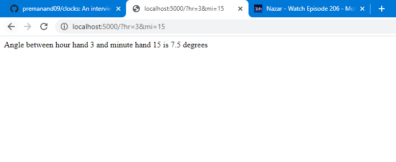
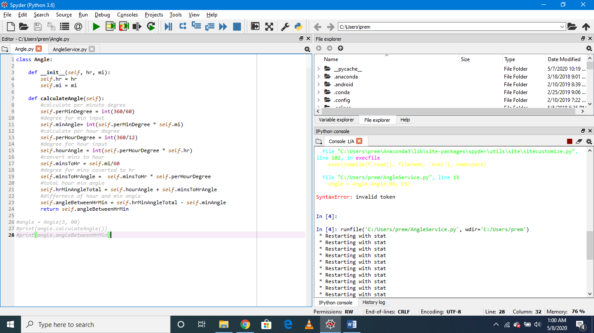

# clocks
An interview exercise for a devops position

# Brief description of how and where application will run
This is web based application designed in python and deployed as flask web service on python.

This application will be accessed using browser URL (given example below) with request parameters as hour and minute value and hit enter. Angle between hour and minute hand will be displayed on browser.

**Below are instructions to setup this application**

Install flask package in python environment: pip install Flask

Run program – python AngleService.py

Request url with parameters – 

Hr – hour hand value

Mi – minute hand value

http://localhost:5000/?hr=3&mi=15

This application runs on python server as webservice. 

AngleService.py – this file needs to be run. It will host application as webservice on localhost. Use this url to request angle value - http://localhost:5000/?hr=3&mi=15

# Code files
Angle.py – This file contains python code which contains mathematical logic for calculating time value to angle value in degrees.

AngleService.py – This file contains python code which deploys Angle.py code to as webservice using flask api.

# Output
**Request url with parameters**

Hr – hour hand value

Mi – minute hand value

http://localhost:5000/?hr=3&mi=15

**Spyder Editor for python code**

# How will you manage any infrastructure needed?
We can use some cloud services like AWS like elastic beanstalk to deploy python application as web app. 

# Bonus points for a working deployed solution in GCP that you can demo at the "sprint review" (ie interview)
Not familiar with GCP however after some google I found some of the steps I can follow:

Deploying your service

To deploy your web service, you run the gcloud app deploy command from the root directory of your project, where your app.yaml file is located:

gcloud app deploy

Viewing your service

To quickly launch your browser and access your web service at https://PROJECT_ID.REGION_ID.r.appspot.com, enter the following command:
gcloud app browse

# Any DevOps/Cicd components that would support this feature in a production setting
Yaml file for libraries dependencies.
